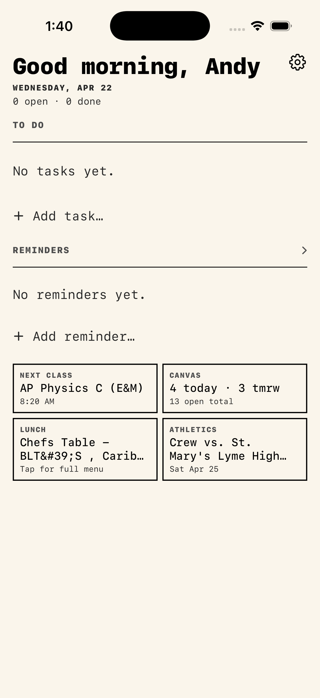

# Andy's Swiss Knife

A single iOS app that replaces five daily apps: todo list, class schedule, dining menu, pomodoro timer, school events, athletics schedule, Canvas assignments.

  

## Features

**To-do list**
- Inline add with one tap — no popup
- Inline title editing, swipe-less trash button
- Auto-grouping by due date: Overdue · Today · Tomorrow · This week · Later · Done
- Optional due date picker, local notifications
- Clear-done button

**Reminders**
- Separate from todos — for personal events like "pick up suit Sunday"
- Inline title + inline notes editor
- Optional date (all-day) with graphical popover picker
- Auto-grouped by date bucket

**Next class**
- Auto-updates through the day — shows whatever class is next
- Editable period grid in Settings → Schedule
- Times follow Suffield A–G period template

**Canvas assignments**
- Import Canvas calendar feed URL in Settings
- Assignments become todos keyed by VEVENT UID (never duplicates)
- Dashboard card shows "N today · M tmrw", total open count
- Dedicated Canvas screen grouped by due date

**Dining menu**
- Scrapes Suffield dining site, caches 3 h
- Card auto-rolls from Lunch → Dinner after 1 pm
- Shows day-of-week and date

**Athletics schedule**
- 49 Suffield teams auto-loaded
- Picker grouped by season (Fall / Winter / Spring) and sport
- Search filter, per-team ICS sync
- Next upcoming game on dashboard

**School events**
- Reads school public ICS feed
- Continuous scroll, grouped by day

**Apple Calendar import**
- Toggle any Apple Calendar on/off to merge into Events
- Live EventKit sync on app foreground

**Pomodoro**
- 25 min focus / 5 min break
- Live Activity on Lock Screen + Dynamic Island (counts down live)
- Wall-clock backed — survives background

**Dashboard customization**
- Drag-and-hold any card to rearrange — springboard-style lift
- Active / inactive card lists in Settings → Layout
- Hide any card, reactivate later

**Widgets**
- Interactive To-do widget (check off tasks from Home Screen via AppIntent)
- Reminders widget
- Lunch/Dinner menu widget
- Next class widget

**Themes**
- Stark White (default) — pure white + black + red accent
- Cream — warm paper background
- Ink — dark mode with yellow accent
- Acid — black + neon green + magenta
- Hazard — yellow warning tape
- Toxic — dark purple + hot magenta + acid green
- All monospaced, sharp corners, thick borders

**Deep links**
- `swissknife://addTodo` and `swissknife://addReminder` open the add panel
- Triggerable from Siri Shortcuts / widgets

**Personal**
- Greets you by name, with time-of-day greeting
- Displays version + build in Settings
- Force-refresh all feeds from one button
